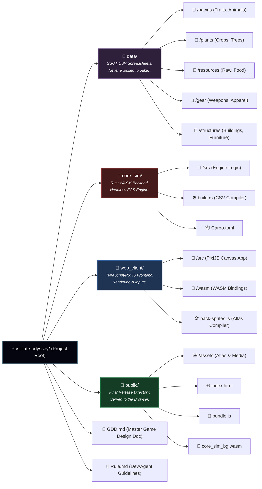

# Post-fate Odyssey Repository Architecture

Welcome new developers! This document outlines the repository's folder structure. The project follows a strict "Split-Brain" architecture between the Rust backend (`core_sim`) and the TypeScript frontend (`web_client`), utilizing heavily optimized data generation rules (`data`).

Below is a visualization of the project architecture:

## Directory Responsibilities

| Directory/File | Responsibility / Description |
| --- | --- |
| **`/data`** | The **Single Source of Truth (SSOT)**. Contains CSV files holding all raw stats, entity data, and game balance rules. These are strictly used during compile time and are never served directly to the player's browser. |
| **`/core_sim`** | The **Brain**. Contains the headless Rust backend using an Entity Component System (ECS). Processes paths, items, thermodynamics, and pawn rules. It communicates with the frontend via flat memory `Float32Array` passing. Includes a `build.rs` script that permanently bakes `/data/*.csv` files directly into the compiled WASM binary. |
| **`/web_client`** | The **Eyes**. Contains the TypeScript and PixiJS source code. Responsible solely for translating the data arrays generated by WASM into smooth, hardware-accelerated 2D graphics, and handling touch/mouse intents from the DOM. |
| **`/public`** | The **Deployment Target**. The final output folder for WASM binaries, Webpack-bundled Javascript (`bundle.js`), and heavily compressed `spritesheet.png` asset atlases. This is the only directory exposed to the web server. |
| **`GDD.md`** | The Master Project Blueprint. Defines memory caps, mechanics, AI storytellers, grids, and physics expectations. |
| **`Rule.md`** | Outlines distinct "Agent" developer personas (like UI Engineer, AI Scripter, Art Coordinator) and basic workspace cleanliness rules. |
